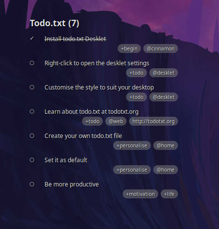
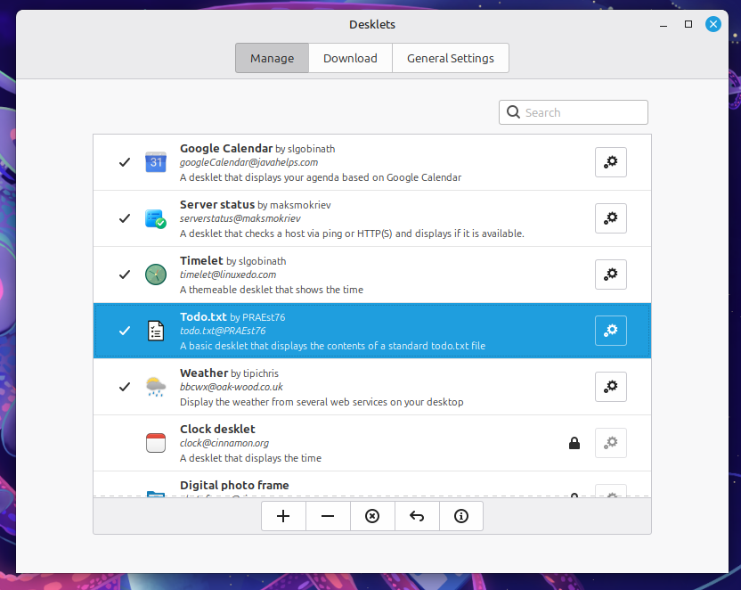
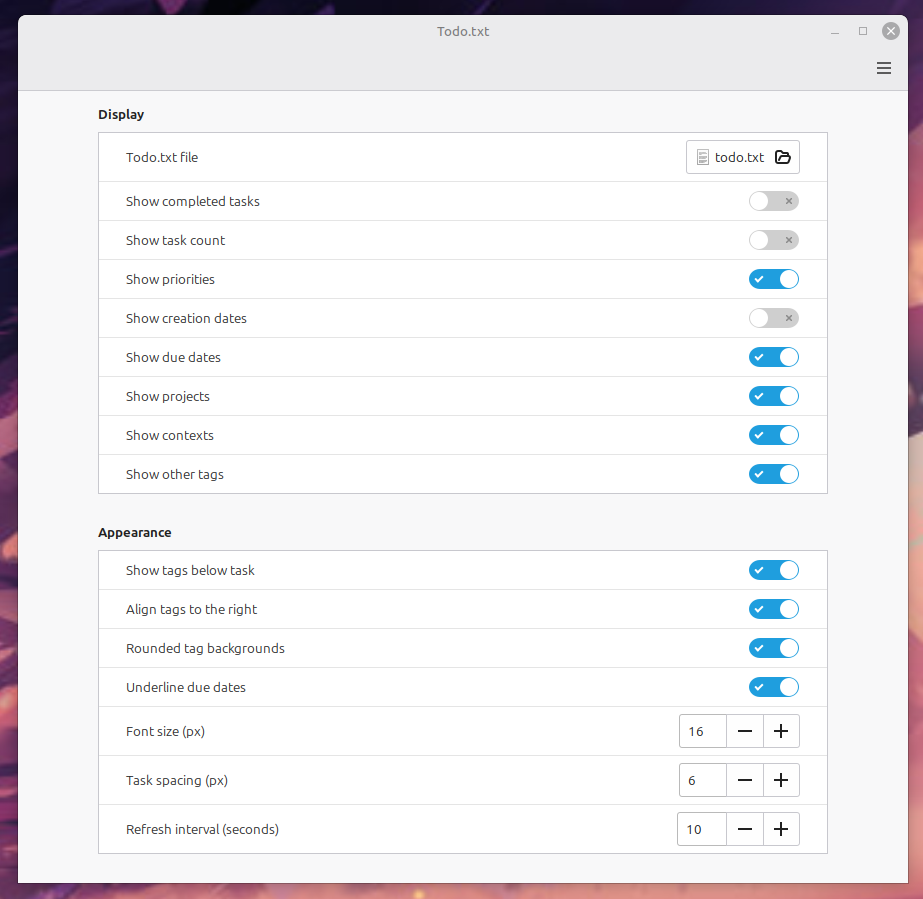

# Todo.txt Desklet for Cinnamon



## Description

A Cinnamon desklet that displays your todo list from a standard todo.txt file. This is a simple system/platform agnostic text file containing a line for each task including optional creation date, due date and project and context tags.

This format is supported by multiple clients on multiple platforms.

See [http://todotxt.org](http://todotxt.org) for more information.

## Install & Setup

To install extract the release archive to ~/.local/share/cinnamon/desklets/

eg.

```
~/.local/share/cinnamon/desklets/todo.txt@PRAEst76/desklet.js
~/.local/share/cinnamon/desklets/todo.txt@PRAEst76/icon.png
~/.local/share/cinnamon/desklets/todo.txt@PRAEst76/metadata.json
~/.local/share/cinnamon/desklets/todo.txt@PRAEst76/settings-schema.json
~/.local/share/cinnamon/desklets/todo.txt@PRAEst76/stylesheet.css
```

You should then be able to activate it from the Cinnamon Settings Desklets manager ('Desklets' in the Cinnamon menu or `cinnamon-settings desklets` on the terminal).



The Desklet comes with an example todo.txt that is set as default. I reccomend you create your own using your preferred text editor or edit the example and save it to your home directory.

You can select the todo.txt file and customise the display either by clicking the settings icon in Desklets or via the right-click menu on the desklet itself.



Left-clicking on the desklet should load the todo.txt file in your default text editor.

> [!CAUTION]
> I've only tested this with Cinnamon 6.6.9 (the version I'm running, but it *should* work with all 6.x releases and *may* work with later 5.x releases. Please report any issues.)

## Todo.txt Todo

- [x] Add some style options
- [x] Add ability to choose what information is displayed
- [ ] Add ability to mark tasks as done from the desklet.
- [ ] Add the ability to open links from tasks in default browser
- [ ] Fix it so it works on multiple version of cinnamon other than the one I use.
- [ ] Other stuff that comes to mind over time
- [ ] Keep it light